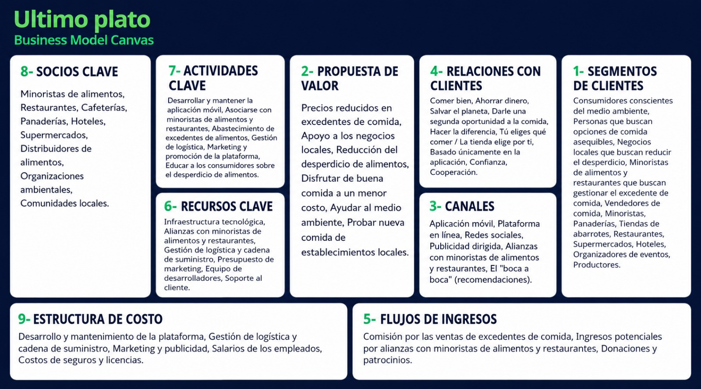

# Último Plato 🍽️🌱
> **"Comida que se salva, ahorro que se comparte."**

**Último Plato** es una aplicación web responsiva y sustentable diseñada para conectar comercios gastronómicos locales que tienen excedentes de comida del día con personas que buscan acceder a comida de excelente calidad a una fracción de su costo original. 

El propósito principal de este MVP (Producto Mínimo Viable) es demostrar el flujo comercial y ecológico en tiempo real durante una hackatón, mostrando el impacto social y ambiental inmediato al rescatar alimentos.

---

## Business Model Canvas
A continuación se detalla el modelo de negocios planteado para la plataforma:

### Desglose del Canvas de Negocio

1. **Segmentos de Clientes:**
   - Consumidores conscientes del medio ambiente.
   - Personas que buscan opciones de comida asequibles y de calidad.
   - Comercios locales que buscan reducir sus pérdidas y el desperdicio.
   - Establecimientos gastronómicos (restaurantes, panaderías, cafeterías, supermercados, verdulerías, hoteles, organizadores de eventos y productores).

2. **Propuesta de Valor:**
   - Acceso a precios sumamente reducidos en excedentes de comida de calidad.
   - Apoyo directo a los negocios gastronómicos de barrio.
   - Reducción activa y medible del desperdicio de alimentos y del impacto de carbono.
   - Oportunidad de probar nuevos platos y establecimientos locales a bajo costo.

3. **Canales:**
   - Aplicación web y plataforma en línea responsive.
   - Redes sociales y campañas de concientización digital.
   - Publicidad geolocalizada.
   - Alianzas estratégicas con comercios y redes de gastronomía.
   - Marketing orgánico mediante recomendaciones de "boca a boca".

4. **Relaciones con Clientes:**
   - Enfoque comunitario basado en la confianza, cooperación y sustentabilidad.
   - Experiencia de usuario simplificada e interactiva (comprar con un par de clics).
   - "Sorpresa sustentable": el comercio elige los productos específicos del excedente, manteniendo el misterio y la flexibilidad.

5. **Flujos de Ingresos:**
   - Comisión porcentual sobre cada venta de pack realizada a través de la plataforma.
   - Suscripciones premium o alianzas corporativas de visibilidad ecológica para comercios asociados.
   - Donaciones, patrocinios y subsidios gubernamentales orientados a proyectos verdes.

6. **Recursos Clave:**
   - Infraestructura y plataforma tecnológica (servidores, API, base de datos).
   - Base activa de comercios asociados y red de usuarios rescatistas.
   - Sistema logístico de retiro en tienda.
   - Equipo técnico de desarrolladores, diseñadores y soporte al cliente.

7. **Actividades Clave:**
   - Desarrollo, mantenimiento y actualización continua de la aplicación.
   - Captación y soporte técnico/comercial para comercios gastronómicos asociados.
   - Campañas de marketing y promoción del movimiento "cero desperdicio".
   - Campañas educativas sobre el desperdicio alimenticio.

8. **Socios Clave:**
   - Locales gastronómicos (cafeterías, restaurantes, panaderías, rotiserías, verdulerías, etc.).
   - Distribuidores y bancos de alimentos locales.
   - Organizaciones ambientales y ONGs orientadas al reciclaje orgánico.
   - Comunidades vecinales y colectivos locales.

9. **Estructura de Costos:**
   - Desarrollo, mantenimiento técnico y servidores de la plataforma.
   - Presupuesto de marketing, publicidad y educación al consumidor.
   - Salarios del equipo administrativo, de desarrollo y soporte.
   - Costos administrativos, legales, seguros y licencias de operación.

---

## 🛠️ Tecnologías Utilizadas
Este proyecto está desarrollado bajo un stack moderno y eficiente:
- **Core**: [React 19](https://react.dev/) con [Next.js 16 (App Router)](https://nextjs.org/)
- **Estilos**: [Tailwind CSS 4](https://tailwindcss.com/) (Diseño adaptativo, móvil-primero, y temas optimizados)
- **Iconos**: [Lucide React](https://lucide.dev/) (Set de iconos vectoriales modernos y limpios)
- **Persistencia**: `localStorage` (React Context) para simular una base de datos en tiempo real y permitir flujos cruzados interactivos al instante durante el Pitch.

---

##  Características Principales

###  Selector de Rol Universal en Cabecera
Ubicado de forma fija en el Navbar (tanto en computadoras como en celulares), permite alternar entre el rol de **Consumidor** y de **Comercio** con un solo toque. 
- Al cambiar de rol, el menú de navegación se actualiza dinámicamente: bloquea las opciones de comercio al consumidor y viceversa para evitar flujos inconsistentes.

###  Panel del Consumidor ("Buscar Comida")
- **Filtros de Categorías Responsivos**: Píldoras de selección ("Todos", "Panadería", "Café", etc.) que se envuelven (`flex-wrap`) en móviles en vez de desbordarse, haciéndolos legibles y fáciles de seleccionar.
- **Grilla de una Columna con Ancho Acotado (`max-w-[300px]`)**: En móviles, las tarjetas se apilan verticalmente centradas, limitando su ancho para que no se estiren de forma antiestética y los botones se mantengan a un tamaño ergonómico perfecto para el pulgar.
- **Tarjeta de Producto Detallada (`PackCard`)**: Muestra la distancia calculada al lado del comercio (`Café Centro • 0.4 km`), el título, stock disponible y precio en una sola fila compacta, con el botón "Reservar" debajo de forma segura.

###  Confirmación con Ticket Digital
- Al reservar, la app actualiza el stock local en tiempo real y despliega un ticket digital de confirmación con un **código de retiro rápido** (Ej. `UP-5729`) y un código QR simulado para agilizar la entrega en tienda.

###  Panel del Comercio ("Soy Comercio")
- **Publicar Excedentes**: Formulario rápido para subir el pack sobrante del día con título, categoría, descripción, precio único de oferta, stock y horario de entrega.
- **Simulador de Validación**: Permite ingresar el código digital del cliente (Ej. `UP-5729`) para corroborar la reserva y marcarla como "Entregada" de manera dinámica.

###  Dashboard de Impacto Real
Métricas de sostenibilidad actualizadas al instante con cada pack rescatado:
- **Packs Rescatados**: Contador total de transacciones sustentables.
- **Alimentos Salvados (kg)**: Estimación física de residuos orgánicos evitados (promedio de 750g por pack).
- **Pesos Ahorrados**: Dinero total que el consumidor ahorró en comparación a la compra normal.
- **Huella Ecológica (CO₂ y Agua)**: Visualización del impacto positivo (reducción de emisiones de gases de efecto invernadero y litros de agua potable conservados).